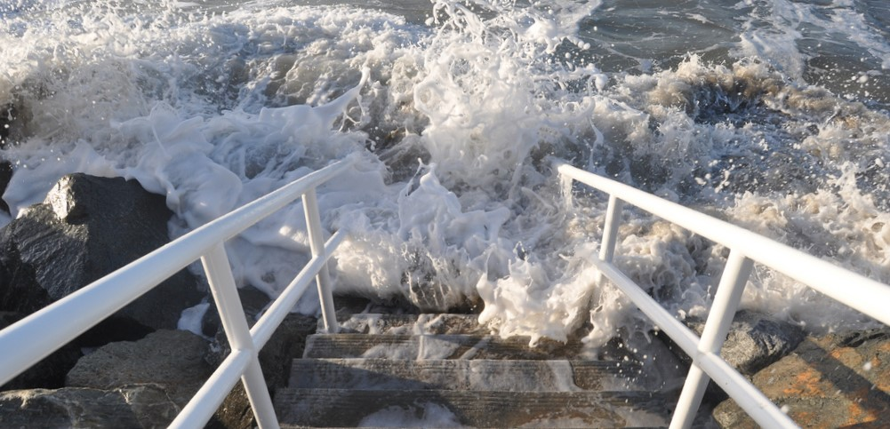
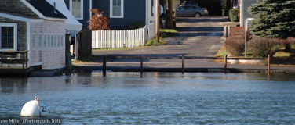
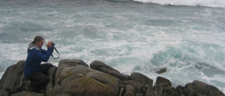

Local projects are lead by citizen scientists on coastlines around the world. They capture data and images to show what the future sea levels will be. This helps communities
understand how sea level rise will impact their lives.

The term ‘king tide’ refers to high tide events occurring twice a year, when there is alignment of the gravitational pull between sun and moon.

When king tides occur during cyclones, floods or storms, water levels can rise to higher levels and have the potential to cause great damage to property and the coastline. These events help us to see where we are vulnerable to sea level rise.

 

> [Learn more about king tides, sea level rise and the connection to climate change.](learn-about-kingtides)

> [See a collection of some of the incredible images and videos from community around the world](experience)

## Participate

The King Tides Project is a fun way to explore your community, while supporting scientists and decision makers to plan for future sea level rise.

Use the Google map below to find a King Tides Project near you.  [Learn how how else you can participate.](participate)

<iframe src="https://www.google.com/maps/d/embed?mid=1o2U1HoaT9Lgi4qowx2ujf2sqBaw" width="640" height="480"></iframe>

## Make the most of your King Tides experience:

Since this initiative started in 2009, organizers have contributed some excellent guidance and resources to help others.

- [Plan your photo shoot](plan-your-shoot)
- [Build curriculum around king tides](curriculum)

## About Us

The Project started in Australia in 2009 and has since grown and expanded, especially in North America. [Learn more about our history, mission and ways of working.](about)
