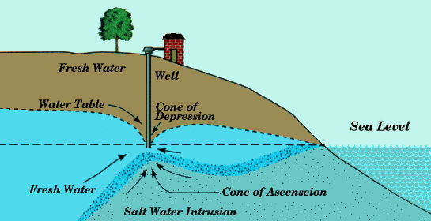

For millions of years, the average temperature of  Earth has allowed a certain amount of moisture to be locked up in frozen reservoirs: glaciers and polar ice caps. This is changing very quickly due to the extreme volume of greenhouse gases humans are releasing into the atmosphere.

Additionally, as the ocean warms, it expands and it’s volume increases.

While the ocean level is rising, in some areas the land is still rising, or rebounding since the last ice age, or as glaciers melt. Additionally, the topography, or shape of the land will have some impact on how tides and water levels interact with the coastline.

Geo-science experts help us to understand these factors, and have lead to data sets that can tell us where sea level rise will have the most impact.

## Resources:
- [NOAA – Sea Level Rise and Coastal Flooding Impacts (interactive map, US based)](http://csc.noaa.gov/slr/viewer/)
- [National Geographic – If all the ice melted (interactive story map)](http://ngm.nationalgeographic.com/2013/09/rising-seas/if-ice-melted-map)
- [Sea level Rise Explorer (interactive Google map, global)](http://www.globalwarmingart.com/wiki/Special:SeaLevel)

## People will experience the impacts of sea level rise to varying degrees.

While those living directly on the coast will feel the impacts most directly, others will suffer from coastal flooding. Some examples:

- If you pay taxes to a regional government that has infrastructure on the coast, your taxes will likely go up – whether or not your home is on the coast. (Low-lying roads, wastewater treatment facilities, energy facilities, stormwater infrastructure, potable water systems, and electricity transfer systems are at risk of inundation and flooding, and impaired function.)
- Sunshine destinations with economies reliant on beach going tourists, and tourism travel industry, will suffer the costs of  reduced visitation in addition to adaptation measures.
- Food production in coastal flood plains can be adversely affected by flooding and saltwater intruding groundwater  irrigation sources, impacting worldwide markets for produce.
- Public access & recreation will be impacted by loss of beaches or other recreation areas are immediately adjacent to the beach.
- Archeological and paleontological sites, including Indigenous villages, religious and ceremonial locations, burial sites, and other areas could be at risk from sea-level rise.

Learn more about how sea level rise will affect you.

[Credit: Sabrina Doyle [Click for more information about saltwater in wells]](https://sabrinadoyle.com/2011/07/26/researchers-monitoring-salt-water-in-wells/)
